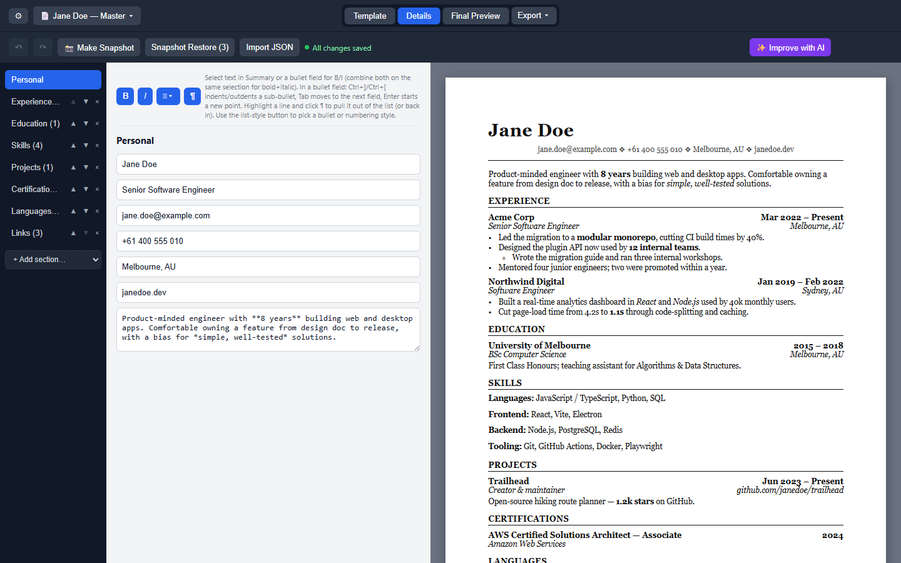
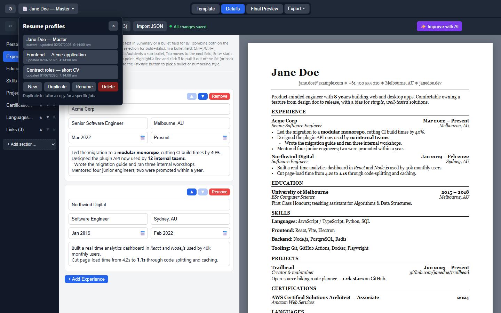
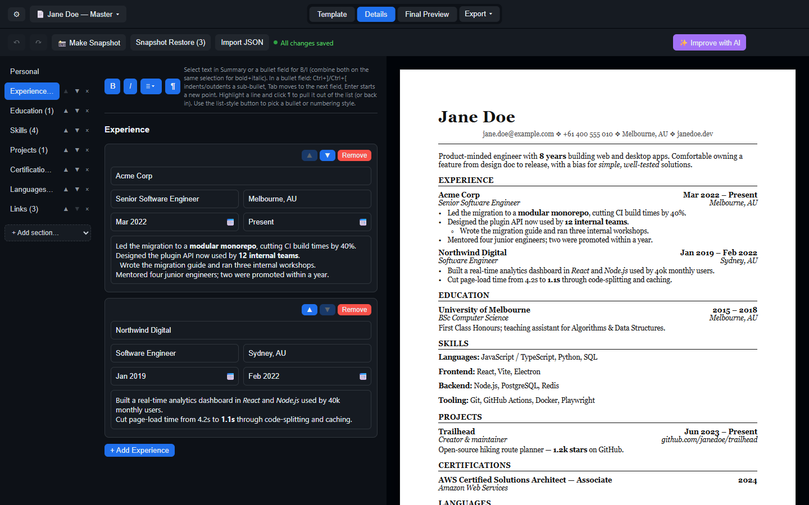
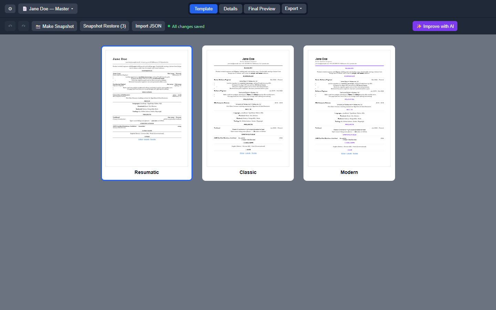
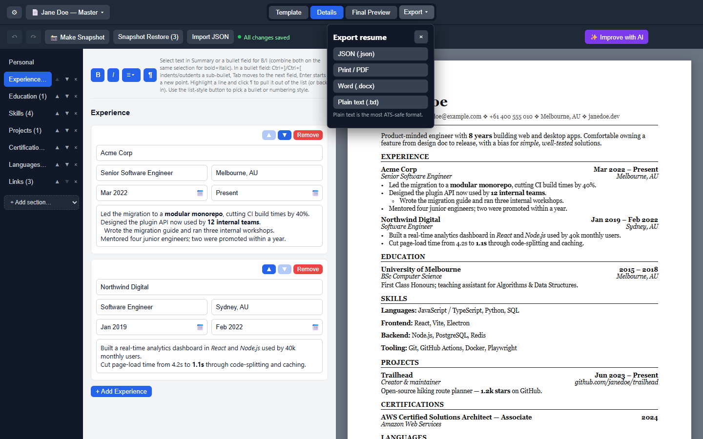
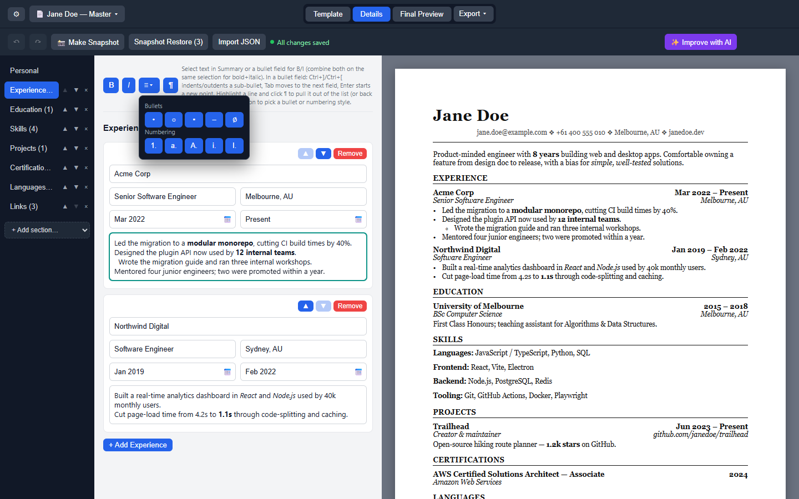
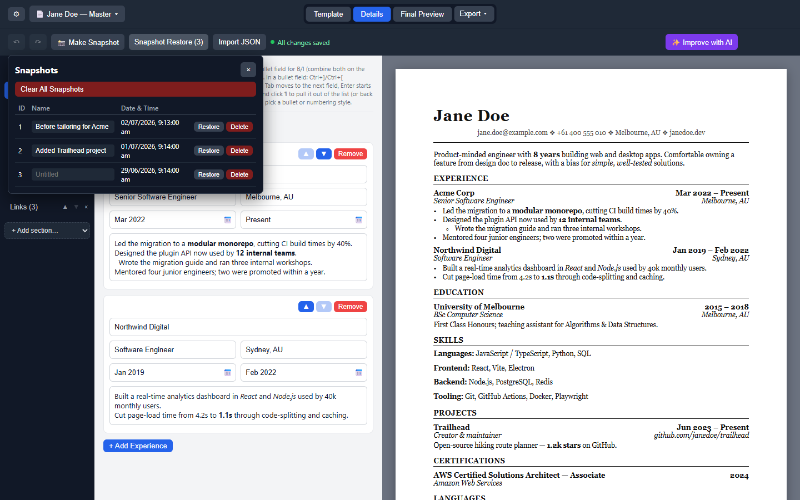
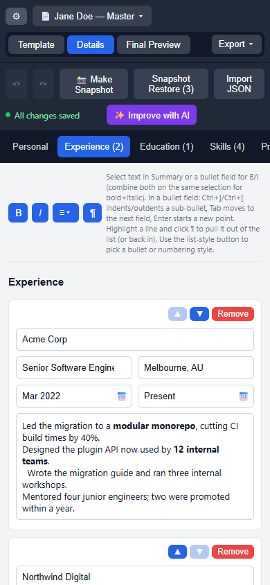
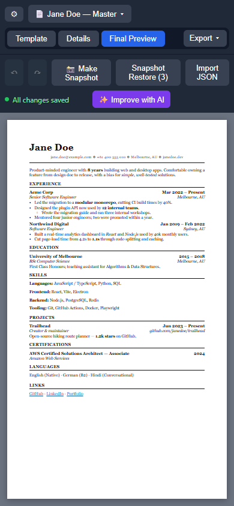

# OpenResume Builder

OpenResume Builder Beta 3 is the browser-first release: a free, open-source resume builder built with **React + Vite** and served by a minimal Node server.



## Features

- **Multiple resume profiles** — keep a master resume plus tailored copies per application; New / Duplicate / Rename / Delete from a toolbar dropdown, with per-profile autosave, snapshots, and undo history
- **Export to JSON, PDF, Word (.docx), and plain text (.txt)** — browser printing provides Save as PDF; bold/italic become real Word formatting, bullet/numbering styles become real Word numbering, links become clickable hyperlinks; plain text is the most ATS-safe format
- **Dark mode** — three-way System / Light / Dark, applied before first paint (no white flash); the resume preview stays paper-white, because it represents the printed page
- **Customizable resume sections** — Experience, Education, Skills, Projects, Certifications, Languages, Links, and free-form Custom sections; add, remove, rename, and reorder whole sections, and reorder individual entries within a section
- **Three templates** — Classic, Modern, and Resumatic (serif, bold header), switchable from a live-thumbnail template gallery
- **Template / Details / Final Preview workspace** — pick a template visually, edit in the section-based form, then check a clean chrome-free preview before exporting
- **WYSIWYG bold/italic** — Experience descriptions, Custom Section, and Skills render real bold/italic as you type, no visible `**`/`*` markup; use Ctrl/Cmd+B or Ctrl/Cmd+I on selected text (or the toolbar); combinable into bold+italic, with a Word/LibreOffice-style bullet & numbering picker (•, ○, ▪, –, 1., a., A., i., I.), an intro-sentence-before-the-list option, and Word-style list editing (Ctrl/Cmd+] / Ctrl/Cmd+[ to indent, Enter continues the list)
- **Undo/redo** — Ctrl+Z / Ctrl+Y plus ↶/↷ toolbar buttons; rapid edits coalesce so undo rewinds a typing burst, not a keystroke
- **Month/year date picker** — click a Start/End field (Experience, Education, Projects) for a year navigator and month grid, with a "Present" quick-pick and future dates blocked automatically
- **Autocomplete & autocorrect** — suggestion dropdowns for Title, Role, Skill, Degree, and Language-proficiency fields, plus real spellcheck with right-click correction suggestions
- **Snapshot backups** — take a named, timestamped snapshot at any point, then browse/restore/rename/delete from a table, with a confirmation warning before restoring
- **Autosave status indicator** — "Saving…" / "All changes saved" in the toolbar
- **Import / export JSON** — browser-native file selection and downloads preserve the existing resume format without sending resume data to a server
- **Responsive browser workspace** — desktop, tablet, and narrow mobile layouts with ordinary browser spellcheck, extensions, and DevTools
- **Tested** — Vitest unit tests plus a Playwright browser e2e suite; lint, tests, build, and browser smoke checks gate every push

## Screenshots

| Resume profiles | Dark mode |
|---|---|
|  |  |

| Template gallery | Export formats |
|---|---|
|  |  |

| Text formatting & sub-bullets | Named snapshots |
|---|---|
|  |  |

| Mobile editing | Mobile preview |
|---|---|
|  |  |

More in the [wiki Screenshots page](https://github.com/Abhisek571/openresume-builder/wiki/Screenshots).

## Keyboard shortcuts

See the browser-app [Keyboard Shortcuts reference](docs/keyboard-shortcuts.md) for formatting, undo/redo, bullet editing, and intentional no-op behavior.

## Run locally

Requires Node.js 20.19 or newer (an active LTS release is recommended):

```bash
npm install
npm start
```

Open `http://127.0.0.1:4173`. The production server serves the built app and exposes only health/version diagnostics; resume content remains in browser local storage.

Browser support: Chrome/Chromium and Edge are covered by automated checks. Firefox and Safari are supported targets, but their native Print / Save as PDF output still requires platform-specific manual validation.

## Roadmap

See the [Roadmap wiki page](https://github.com/Abhisek571/openresume-builder/wiki/Roadmap) for planned work.

## Branches & versions

- **`master`** — latest stable release (currently **v2.2.6**); what the Releases page ships.
- **`beta-3`** — the Beta 3 browser-first branch for the next major version (**v3**); it is not yet a tagged v3 release.
- **`beta`** — _retired._ It was the 2.x prerelease channel through v2.2.x and is no longer used for new work; `beta-3` supersedes it.

## Contributing / running from source

See [DEVELOPMENT.md](DEVELOPMENT.md) for setup, browser development, testing, and production serving.

## License

MIT — free to use, modify, and distribute.
